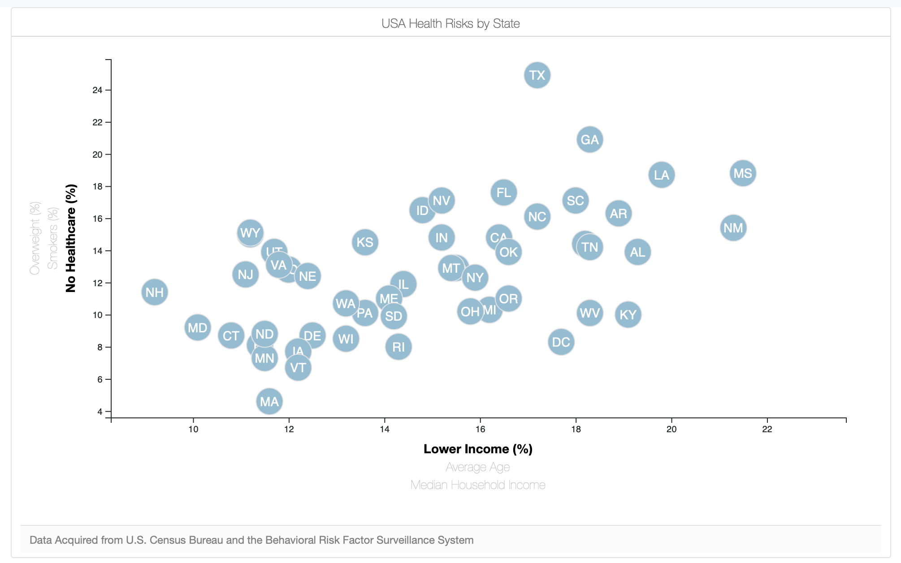
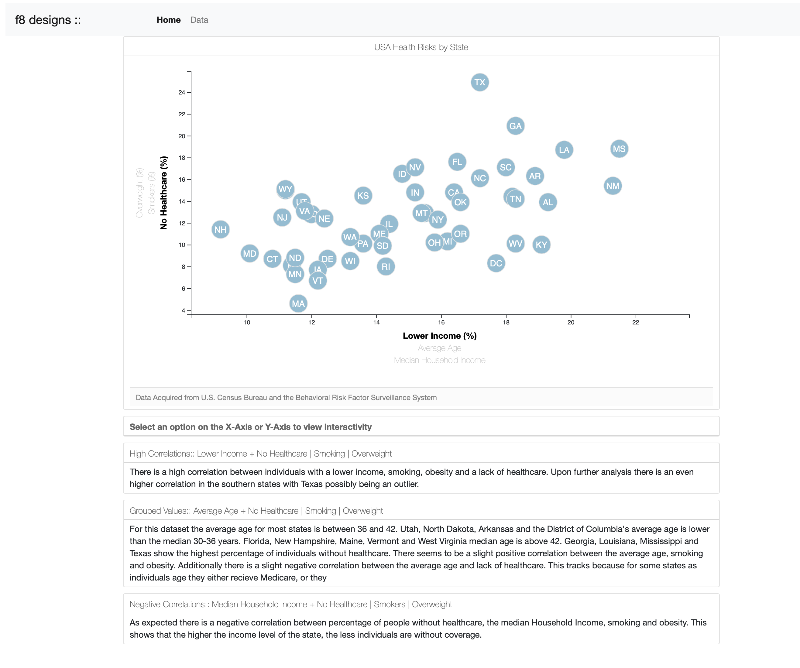

# scatterD3
Analyzing health risks utilizing the U.S. Census Bureau and the Behavioral Risk Factor Surveillance System.

# Background

Utilizing the D3 Library and D3 Tool Tips, visualize the health risks of individuals in the United States by State based on poverty statistics over the year. Data can be found at https://data.census.gov/cedsci/table?q=healthcare%20and%20poverty&tid=ACSST1Y2019.S1701&hidePreview=false

# Develoment
###### `python -m http.server`

Use the command above to create a local server environment, past the link localhost:8000 into your browser to best view the interactivity.

